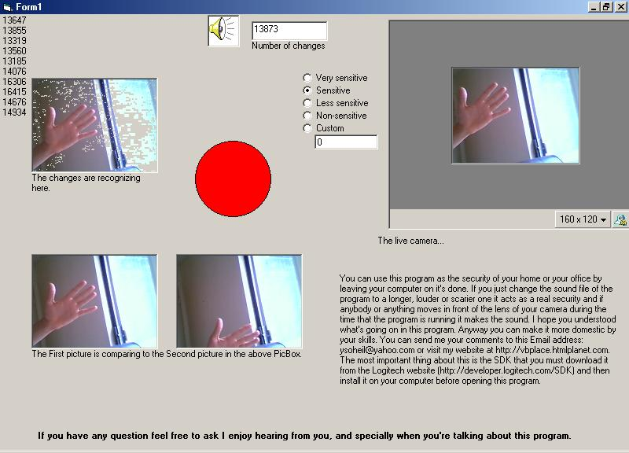

<div align="center">

## Anti Thief


</div>

### Description

You can catch the robbers of your store, office or home.You need some DLL files(ActiveX Video Protal) you can get that file from the Logitech Developer website or directly from my website at this address: http://geocities.com/ysoheil/Files.zip
 
### More Info
 
The pictures from a live logitech camera.

You need to submit a form and dowload the SDK from the the logitech website: http://developer.logitech.com/sdk/

True=Someone is robbing something or False=NOT


<span>             |<span>
---                |---
**Submitted On**   |2001-06-08 13:59:42
**By**             |[Soheil Yasrebi](https://github.com/Planet-Source-Code/PSCIndex/blob/master/ByAuthor/soheil-yasrebi.md)
**Level**          |Intermediate
**User Rating**    |4.7 (52 globes from 11 users)
**Compatibility**  |VB 3\.0, VB 4\.0 \(16\-bit\), VB 4\.0 \(32\-bit\), VB 5\.0, VB 6\.0
**Category**       |[VB function enhancement](https://github.com/Planet-Source-Code/PSCIndex/blob/master/ByCategory/vb-function-enhancement__1-25.md)
**World**          |[Visual Basic](https://github.com/Planet-Source-Code/PSCIndex/blob/master/ByWorld/visual-basic.md)
**Archive File**   |[Anti Thief20827682001\.zip](https://github.com/Planet-Source-Code/soheil-yasrebi-anti-thief__1-23800/archive/master.zip)

### API Declarations

```
GetPixel
SetPixel
```


